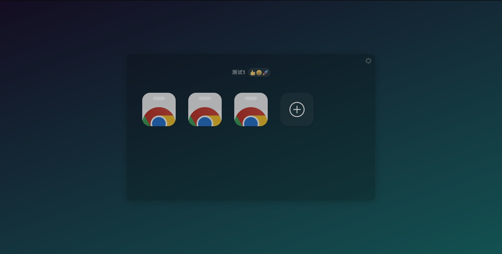

# watchTV-ng

基于 [watchTV](https://github.com/cornradio/watchTV), 使用 Svelte + Typescript + Vite 重构。

## Demo

访问[这里](https://izfsk.top/~izfsk/watchTV.html)查看示例。



## 实现进度

- [x] 源项目功能克隆
- [ ] 手机端适配
- [X] 编辑模式
- [X] 更好的新增 `Entry` 页面
- [X] 更多主题自定义选项
- [ ] 创作与分享 json 的 mini 社区（计划用 github）

## 构建

```sh
./node_modules/.bin/ts-interface-builder src/types.ts  # 如果修改过 interface
yarn run build
```
